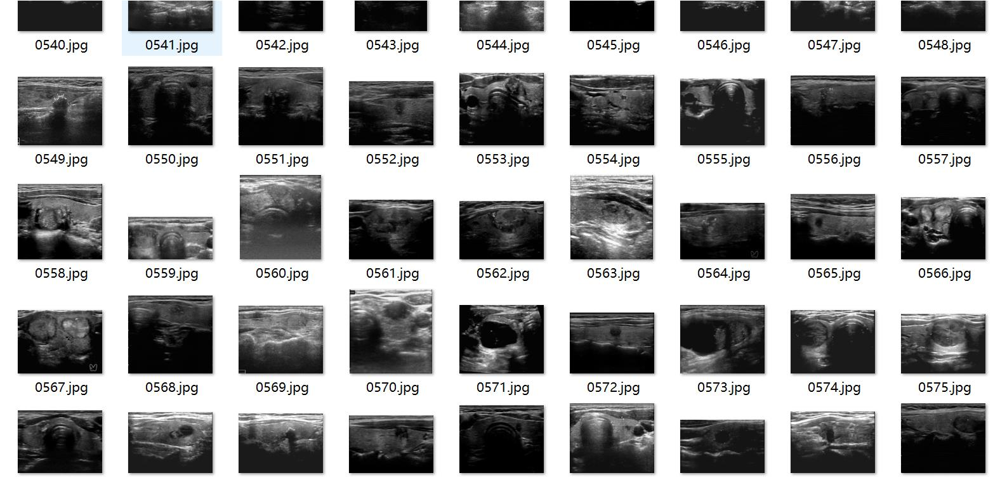
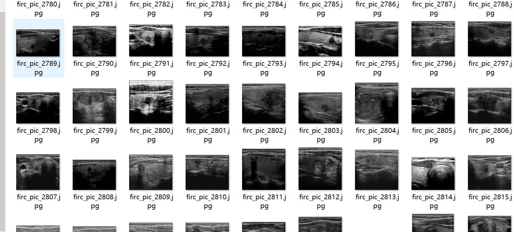
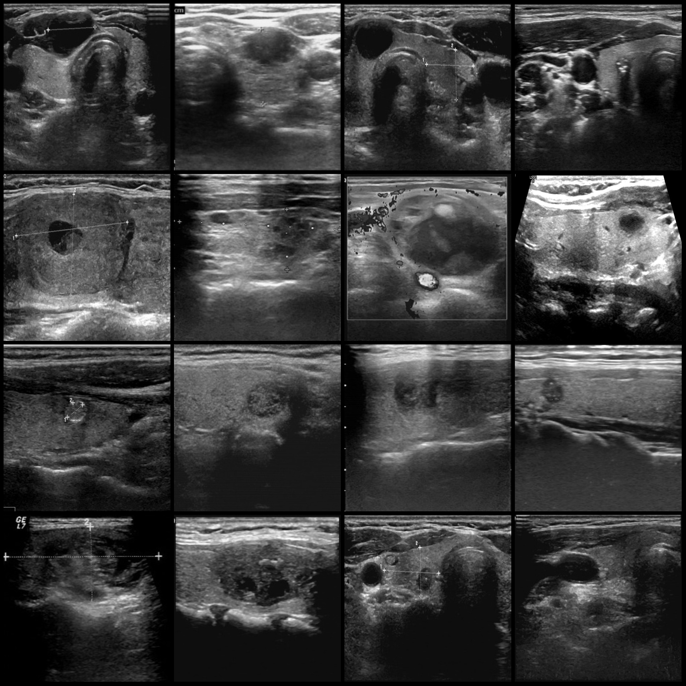
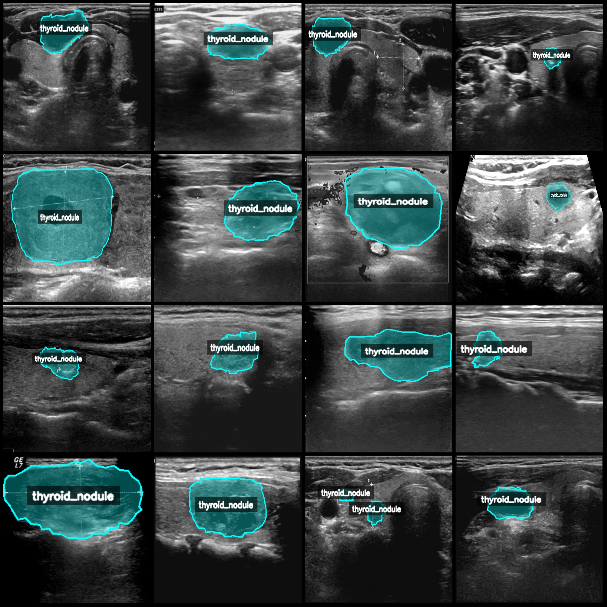
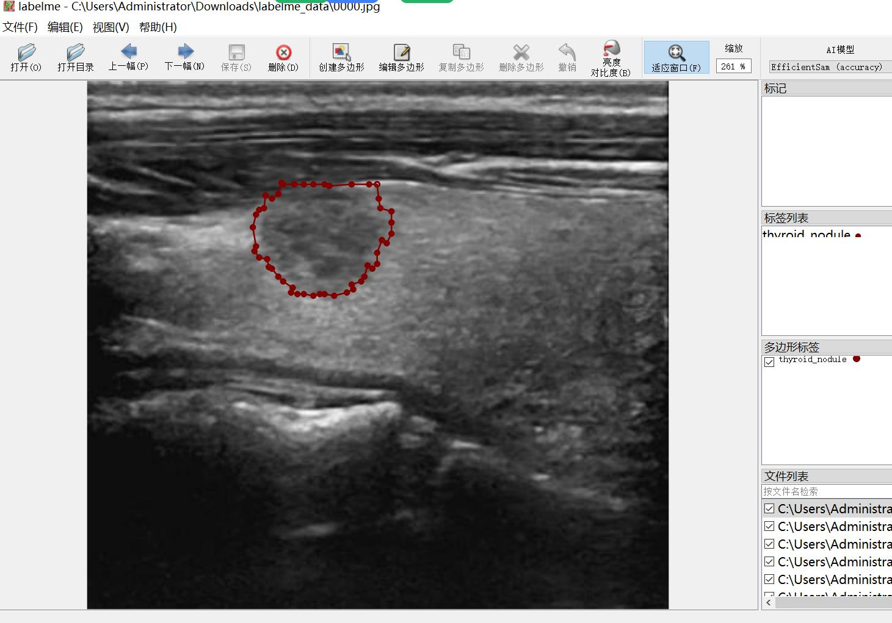

# Wisdom Medical TN3K dataset: Thyroid Nodule Segmentation and Identification Dataset in LabelMe Format with 3,493 Images

The dataset format is LabelMe (excluding mask files but including JPG images and corresponding JSON files). The number of images (JPG file counts) is 3,493. The number of annotations (JSON file 
counts) is also 3,493. There are 1 category of annotations.

- Image format: LabelMe
- Number of images: 3,493
- Number of annotations: 3,493
- Number of categories: 1
- Annotation category name: ["thyroid_nodule"]
- Number of bounding boxes per category: 3,736
- Annotation tool used: labelme=5.5.0
- Image resolutions: Multiple resolution images, such as 414x380, 534x394, etc.
- Annotation rules: Polygons for categories are drawn.
- Important note: The dataset can be opened for editing in LabelMe, and the JSON dataset needs to be converted into either Mask or Yolo format or COCO format for semantic segmentation or instance 
segmentation.
- Special declaration: This dataset does not guarantee any accuracy in the training models or weight files.

Image previews:

Annotation examples:

Original images (select 16 images at random):
Annotation drawing results:
LabelMe editing image example:

## Images

Here is a pay link on Stripe ( https://buy.stripe.com/3cs8yP7sY87d0vu9AB ). Please contact me lonlonago@foxmail.com after funding $89, and I will send you a complete data files , thank you!

